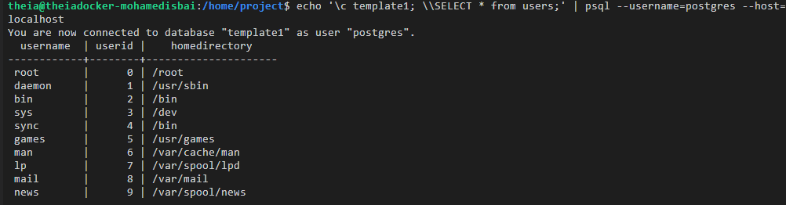

# ETL-Pipeline-using-Bash
this repository contains a small project in which I have used bash scripting to create an ETL pipeline that exctracts data from default /etc/passwd file on linux and transform it to sql table.

## Problem 1 :
we will create a shell script which does the following.

Extract the user name, user id, and home directory path of each user account defined in the /etc/passwd file.
Save the data into a comma separated (CSV) format.
Load the data in the csv file into a table in PostgreSQL database.
5.1. Create a shell script

Step 1: On the menu on the lab screen, use File->New File to create a new file.

Screenshot highlighting New file in File dropdown menu

Step 2: Give the name as 'csv2db.sh' and click 'OK'.

Step 3: State the objective of the script using comments.

Copy and paste the following lines into the newly created file.

This script Extracts data from /etc/passwd file into a CSV file.

The csv data file contains the user name, user id and  home directory of each user account defined in /etc/passwd

Transforms the text delimiter from ":" to ",". Loads the data from the CSV file into a table in PostgreSQL database.
Step 4: Save the file using the File->Save menu option.

5.2. Extract required user information from /etc/passwd

In this step, we will extract user name (field 1), user id (field 3), and home directory path (field 6) from /etc/passwd file using the cut command.

The /etc/passwd has ":" symbol as the column separator.

Copy the following lines and add them to the end of the script.

### Extract phase

echo "Extracting data"

Extract the columns 1 (user name), 2 (user id) and  6 (home directory path) from /etc/passwd

cut -d":" -f1,3,6 /etc/passwd 
Save the file.

Run the script.

bash csv2db.sh
Verify that the output contains the three fields, that we extracted.

5.3. Redirect the extracted output into a file.

In this step, we will redirect the extracted data into a file named extracted-data.txt

Replace the cut command at end of the script with the following command.

cut -d":" -f1,3,6 /etc/passwd > extracted-data.txt
Save the file.

Run the script.

bash csv2db.sh
Run the command below to verify that the file extracted-data.txt is created, and has the content.

cat extracted-data.txt
5.4. Transform the data into CSV format

The extracted columns are separated by the original ":" delimiter.

We need to convert this into a "," delimited file.

Add the below lines at the end of the script

### Transform phase
echo "Transforming data" read the extracted data and replace the colons with commas.

tr ":" "," < extracted-data.txt
Save the file.

Run the script.

bash csv2db.sh
Verify that the output contains ',' in place of ":".

Replace the tr command at end of the script with the command below.

tr ":" "," < extracted-data.txt > transformed-data.csv
Save the file.

Run the script.

bash csv2db.sh
Run the command below to verify that the file transformed-data.csv is created, and has the content.

cat transformed-data.csv
5.5. Load the data into the table 'users' in PostgreSQL

To load data from a shell script, we will use the psql client utility in a non-interactive manner.

This is done by sending the database commands through a command pipeline to psql with the help of echo command.

Step 1: Add the copy command

PostgreSQL command to copy data from a CSV file to a table is COPY.

The basic structure of the command which we will use in our script is,

COPY table_name FROM 'filename' DELIMITERS 'delimiter_character' FORMAT;
Now, add the lines below to the end of the script 'csv2db.sh'.

### Load phase
echo "Loading data" Send the instructions to connect to 'template1' and copy the file to the table 'users' through command pipeline.

echo "\c template1;\COPY users  FROM '/home/project/transformed-data.csv' DELIMITERS ',' CSV;" | psql --username=postgres --host=localhost
Save the file.

### checking results

